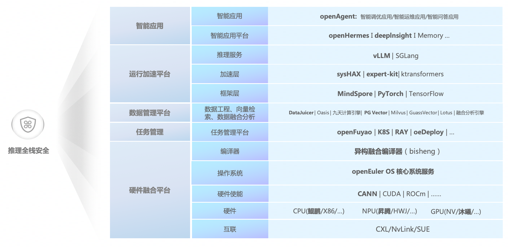

# OpenEuler Open-Source Full-Stack AI inference Solution (Intelligence BooM) #

**If your application scenario meets the following requirements, you can also download the following three images to start the use journey:**

**1CPU+NPU (800I A2)**

· \* \* Hardware specifications: \* \* Supports single-node system, two-node cluster, four-node cluster, and large cluster.

· \* \* image path: \*\*hub.oepkgs.net/oedeploy/openeuler/aarch64/intelligence_boom:0.1.0-aarch64-800I-A2-openeuler24.03-lts-sp2 hub.oepkgs.net/oedeploy/openeuler/x86_64/intelligence_boom:0.1.0-x86_64-800I-A2-openeuler24.03-lts-sp2

**2CPU+NPU (300I Duo)**

· \* \* Hardware specifications: \* \* Single-node system and two-node cluster are supported.

· \* \* image path: \*\*hub.oepkgs.net/oedeploy/openeuler/aarch64/intelligence_boom:0.1.0-aarch64-300I-Duo-openeuler24.03-lts-sp2 hub.oepkgs.net/oedeploy/openeuler/x86_64/intelligence_boom:0.1.0-x86_64-300I-Duo-openeuler24.03-lts-sp2

**3CPU+GPU (NVIDIA A100)**

· \* \* Hardware specifications: \* \* Supports single-node single-card and single-node multi-card.

· image path: hub.oepkgs.net/oedeploy/openeuler/aarch64/intelligence_boom:0.1.0-aarch64-A100-openeuler24.03-lts-sp2 hub.oepkgs.net/oedeploy/openeuler/aarch64/intelligence_boom:0.1.0-aarch64-syshax-openeuler24.03-lts-sp2-

\*\*Our vision: \* \* Build open-source AI basic software de facto standards based on openEuler to promote the prosperity of the enterprise intelligent application ecosystem.

**When big models meet industry implementation, why do we need a full-stack solution?**

DeepSeek innovation lowers the threshold for implementing large models. AI enters the "Jervins Paradox" moment. Requirements increase significantly, multi-modal interaction breaks through hardware restrictions, and low computing power requirements reconstruct deployment logic, marking the transition from the "technical verification period" to the "scale implementation period". However, the core contradictions in industry practice gradually emerged:

**Industry pain points**

\*\*Difficult adaptation: \*\*The requirements for inference delay, computing cost, and multi-modal support vary greatly in different industries (such as finance, manufacturing, and healthcare). A single model or tool chain cannot cover diversified requirements.

\*\* High cost: \*\*From model training to deployment, collaboration between (PyTorch/TensorFlow/MindSpore), hardware (CPU/GPU/NPU), and storage (relational database/vector database) is required. Hardware resource utilization is low and O&M complexity increases exponentially.

\*\* Ecosystem fragmentation: Tool chains of hardware vendors (such as Ascend and NVIDIA), framework vendors (such as Huawei, Meta, and Google), and cloud vendors (such as K8s and RAY) are incompatible with each other. Patchwork deployment leads to long development cycles and inefficient iterations. Technical challenges

\*\*Inference efficiency bottleneck: \* \*The parameter scale of large models exceeds trillions. Traditional inference engines do not support dynamic graph calculation, sparse activation, and hybrid precision, causing a serious waste of computing power.

\*\*Inefficient resource collaboration: \*\*Heterogeneous computing power scheduling of CPUs, GPUs, and NPUs depends on manual experience. Memory and video memory fragmentation leads to idle resources.

To solve the preceding problems, we collaborate with the open source community to accelerate the maturity of the open source inference solution Intelligence BooM.

## Technical Architecture ##

	

#### **Intelligent Application Platform: Quickly Connect Your Business to AI** ####

**Component: openHermes (Agent-Tone Engine, which uses the public capabilities of the platform and provides the following capabilities: Typical application cases, multi-modal interaction middleware, lightweight framework, service flow orchestration, and prompt word engineering.) and deeplnsight (Service insight platform, providing multi-modal identification and deep research capabilities)**

\[DeepInsight open source address\] https://gitee.com/openeuler/deepInsight

**Core Value**

**Low-code development: OpenHermes provides the natural language-driven task orchestration capability, allowing service personnel to generate AI application prototypes through dialogue-based interaction.**

**Effect tracking: Deeplnsight monitors the model inference effect (such as accuracy, delay, and cost) in real time, and provides optimization suggestions based on service indicators (such as conversion rate and failure rate), implementing closed-loop management of data, models, and services.**

#### **Inference service: enabling models to run efficiently** ####

**Components: vLLM (high-performance large model inference framework) and SGLang (multi-modal inference acceleration library)**

\[vLLM open source address\] https://vllm.hyper.ai/docs

**Core Value**

**Dynamic scaling: vLLM supports on-demand model loading and uses the Kubernetes automatic scaling policy to reduce the idle computing power cost by more than 70%.**

\*\*Big model optimization: \*\*VLLM uses technologies such as PagedAttention and continuous batch processing to reduce the inference delay of trillion-parameter models by 50% and improve the throughput by three times.

#### **Acceleration layer: Make reasoning "one step faster"** ####

**Components: sysHAX, expert-kit, and ktransformers**

\[sysHAX open source address\] https://gitee.com/openeuler/sysHAX

\[Expert-Kit open source address\] https://gitee.com/openeuler/expert-kit

**Core Value**

**Heterogeneous computing power collaboration distributed inference acceleration engine: Integrates the computing features of different architecture hardware such as CPU, NPU, and GPU, optimizes dedicated hardware processing dedicated tasks through dynamic task allocation, virtualizes scattered heterogeneous computing power into a unified resource pool, implementing fine-grained allocation and elastic scaling.**

#### **Framework layer: Make the model "inclusive"** ####

**Components: MindSpore (all-scenario framework), PyTorch (Meta general framework), and TensorFlow (Google industrial framework)**

\[MindSpore open source address\] https://gitee.com/mindspore

**Core Value**

\*\*Multi-framework compatibility: \* \* Unified APIs allow users to directly invoke models trained by any framework without rewriting code.

**Dynamic graph optimization: For dynamic control flows (such as condition judgment and loop) of large models, the graph optimization capability is provided, improving the inference stability by 30%. Community ecosystem reuse: Inherit ecosystem tools (such as Hugging Face model library) of PyTorch/TensorFlow, reducing model migration costs.**

#### **Data engineering, vector retrieval, and data fusion analysis: transformation from raw data to inference fuel** ####

**Components: DataJuicer, Oasis, nine-day computing engine, PG Vector, Milvus, GuassVector, Lotus, and converged analysis engine**

**Core Value**

**Efficient processing and management of multi-modal data: Unified access, cleaning, storage, and indexing of multi-modal data solves complex data types and large-scale management problems in inference scenarios and provides standardized data foundation for upper-layer intelligent applications.**

\*\*Effective search and real-time response support: \*\*Quick matching and real-time query of massive high-dimensional data meet the strict requirements on data timeliness and accuracy in inference scenarios and shorten the link delay from data to inference results. Provides underlying performance assurance for real-time applications such as intelligent Q&A and intelligent O&M.

#### **Task management platform: smart resource scheduling** ####

\*\*Components: \*\*OpenFuyao (task orchestration engine), K8S (container orchestration), RAY (distributed computing), and oeDeploy (one-click deployment tool)

\[OpenFuyao open source address\] https://gitcode.com/openFuyao

\[Ray open source address\] https://gitee.com/src-openeuler/ray

\[Open source address of the oeDeploy\] https://gitee.com/openeuler/oeDeploy

**Core Value**

**Device-edge-cloud synergy: Automatically allocates execution nodes based on task types (such as real-time inference and offline batch processing) and hardware capabilities (such as edge NPUs and cloud GPUs).**

**Full-lifecycle management: provides a one-stop O&M interface, including model upload, version iteration, dependency installation, and service startup and shutdown. Fault self-healing: Monitors the task status in real time, automatically restarts abnormal processes, and switches services to the standby node, ensuring high service availability.**

#### **Compiler: Making Code "More Hardware-Savvy"** ####

\*\*Component composition: \*\*Heterogeneous integration compiler (Bisheng)

\[Bisheng open source address\] https://github.com/dataelement/bisheng

**Core Value**

\*\* Cross-hardware optimization: \* \* Automatically converts computing logic based on instruction set differences between CPU (x86/ARM), GPU (CUDA), and NPU (Ascend/CANN), greatly improving computing power utilization by%.

\*\* Mixed precision support: Dynamically adjust the FP32/FP16/INT8 precision, greatly improving the inference speed while the precision loss is controllable. Memory optimization: \* \* Reduces the video memory and memory usage by 30% and reduces hardware costs by using technologies such as operator convergence and memory overcommitment.

#### **Operating System: Make the Full Stack "Stand as a Rock"** ####

**Component: openEuler (open-source EulerOS)**

\[OpenEuler open source address\] https://gitee.com/openeuler

**Core Value**

**Heterogeneous resource management: Supports unified scheduling of CPUs, GPUs, and NPUs, and provides capabilities such as hardware status monitoring and fault isolation.**

**Security enhancement: Integrates the Chinese national cryptographic algorithm, permission isolation, and vulnerability scanning modules to meet compliance requirements of industries such as finance and government.**

#### **Hardware Enablement and Hardware Layer: Make the Most of Computing Power** ####

\*\* Components: \*\*CANN (Ascend AI enablement suite), CUDA (Nvidia computing platform), CPU (x86/ARM), NPU (Ascend), GPU (Nvidia/GPU in China)

**Core Value**

\*\* Hardware potential release: \*\*CANN optimizes matrix computing and vector computing for Ascend NPU Da Vinci architecture, greatly improving computing power utilization. CUDA provides a mature GPU parallel computing framework to support common AI tasks.

\*\*Heterogeneous computing power convergence: \*\*Using unified programming interfaces (such as OpenCL) to implement collaborative computing among CPUs, NPUs, and GPUs, avoiding performance bottlenecks of a single hardware.

#### **Connected technology: "high-speed conversation" with hardware** ####

\*\*Component composition: \*\*UB (universal bus), CXL (computing and memory expansion), NVLink (Nvidia high-speed interconnection), SUE

**Core Values**

\*\*Low latency communication: \*\*CXL/NvLink provides memory-class interconnect bandwidth (>1 TB/s) to reduce cross-device data copy overhead

\*\*Flexible expansion: \*\*Supports seamless expansion from a single-node system (multi-GPU) to a cluster (cross-server) to meet the deployment requirements of enterprises of different scales.

## Full-Stack Solution Deployment Tutorial ##

Currently, the solution supports more than 50 mainstream models, such as DeepSeek/Qwen/Llama/GLM/TeleChat. The following describes how to deploy the DeepSeek V3&R1 model and openEuler Intelligence application.

### DeepSeek V3 and R1 deployment ###

Reference[Deployment Guide](https://gitee.com/openeuler/llm_solution/blob/master/doc/deepseek/DeepSeek-V3&R1%E9%83%A8%E7%BD%B2%E6%8C%87%E5%8D%97.md)	Use the one-click deployment script to start the inference service within 20 minutes.

### One-click deployment of the DeepSeek model and openEuler Intelligence intelligent application ###

Reference[One-click deployment of openEuler Intelligence](https://gitee.com/openeuler/llm_solution/tree/master/script/mindspore-intelligence)	Build a local knowledge base and collaborate with the DeepSeek big model to complete applications such as intelligent optimization and intelligent O&M.

## Performance ##

### Precision ###

This solution uses 8-bit weight quantization, SmoothQuant 8-bit quantization, and hybrid quantization technologies, and finally realizes the deployment of DeepSeek-R1w8a8 large model at the cost of CEval precision loss of 2 points.

| modelling              | CEval Accuracy |
| ---------------------- | -------------- |
| Claude-3.5-Sonnet-1022 | 76.7           |
| GPT-4o 0513            | 76             |
| DeepSeek V3            | 86.5           |
| GPT-4o 0513            | 76             |
| OpenAI o1-mini         | 68.9           |
| DeepSeek R1            | 91.8           |
| Deepseek R1 w8a8       | 89.52          |
| Deepseek R1 W4A16      | 88.78          |
| Deepseek V3 0324 W4A16 | 87.82          |

### Throughput ###

Test environment:

1.  Two Atlas 800I A2 (8 x 64 GB)
2.  Ascend HDK Driver 24.1.0 and Firmware 7.5.0.3.22.
3.  openEuler 22.03 LTS version (kernel 5.10).

| Number of concurrent requests | Throughput (Token/s) |
| ----------------------------- | -------------------- |
| 1                             | 22.4                 |
| 192                           | 2600                 |

## Participation and contribution ##

Welcome to provide your valuable suggestions in the issue mode to build a full-stack open source inference solution with excellent out-of-the-box and leading performance.

# llm_solution #

