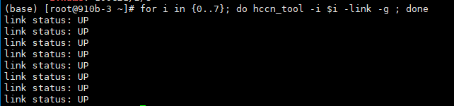
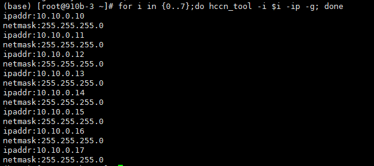
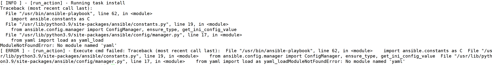

# DeepSeek-V3&R1 Deployment Guide #

## 1. Hardware requirements and networking ##

This document uses DeepSeek-R1 as an example. DeepSeek-V3 and R1 have the same model structure, parameter quantity, and deployment mode as R1.

### 1.1 Single-Node Deployment ###

One Atlas 800I A2 (8 x 64 GB) server is required for deploying the DeepSeek-R1 quantization model (A16W4).

### 1.2 Multi-node deployment ###

At least two Atlas 800I A2 (8 x 64 GB) servers are required for deploying the DeepSeek-R1 quantization model (W8A8).

It is recommended that the NPU direct connection mode be used. That is, all the NPUs of the two servers are connected through the switch, and the network ports are Up.

## 2. Obtain the model weight. ##

| No. | Check Item                                                | Detailed Description                                                                                                                                                                                                                                                                                                                          |
| --- | --------------------------------------------------------- | --------------------------------------------------------------------------------------------------------------------------------------------------------------------------------------------------------------------------------------------------------------------------------------------------------------------------------------------- |
| 2.A | Model weight storage space                                | When downloading A16W4/W8A8 weights, ensure that the storage space in the or mounted disk is greater than 400 GB or 700 GB.                                                                                                                                                                                                                   |
| 2.B | CPU-side memory                                           | Ensure that the CPU memory can release the corresponding weight. For example, the W8A8 weight requires about 500 GB memory. You can run the free -h command to check the free CPU memory. Calculation method: free_mem ≥ (Weight/Number of machines) x 1.3 (This calculation method needs to be verified, but the memory must be sufficient.) |
| 2.C | Select the number of inference cards based on the weight. | W8A8 requires at least two 800I/T A2 64G.                                                                                                                                                                                                                                                                                                     |
| 2.D | Weight Correctness Check                                  | Ensure that the weights are correct and compare the MD5 or SHA256 values of the weights and tokenizer files with those of the source files.                                                                                                                                                                                                   |

### 2.1 Downloading Quantified Model Weights ###

A16W4:modelers.cn[IPADS/DeepSeek-R1-A16W4 \| Magic Music Community](https://modelers.cn/models/IPADS/DeepSeek-R1-A16W4)	

W8A8:modelers.cn[MindSpore-Lab/DeepSeek-R1-W8A8 \| Magic Community](https://modelers.cn/models/MindSpore-Lab/DeepSeek-R1-W8A8)	

#### 2.1.1 Weight Placement \[Important\] ####

Weights must be placed on all machines and placed in the same path. This path will be used as a configuration item and will be added to the configuration file of the one-click deployment script. For details, see section 4.1.

For example, the model weight of the master node is stored in /home/ds/deepseek-r1 and that of the slave node is stored in /home/ds/deepseek-r1.

## 3. Driver and firmware preparation ##

### 3.1 Recommended Version ###

| Component           | Community edition |
| ------------------- | ----------------- |
| Ascend HDK Driver   | 24.1.rc3          |
| Ascend HDK Firmware | 7.5.0.1.129       |

#### 3.1.1 HDK Download Mode ####

**Link for downloading the community version: https://www.hiascend.com/hardware/firmware-drivers/community?product=4&model=32&cann=8.0.0.alpha002&driver=1.0.RC2**

The kernel version must be 5.10. Check the kernel version before installation.

```
#You can run the following command to obtain the driver and firmware versions in the environment:
npu-smi info -t board -i 1 | egrep -i "software|firmware"
```

	

Note: Before installing drivers and firmware, install the kernel-devel and kernel-headers packages in advance and ensure that the versions are the same as the server kernel versions.

```
#Installing kernel-devel & kernel-headers
yum install -y kernel-devel-$(uname -r) kernel-headers-$(uname -r)
```

#### 3.1.2 Driver and Firmware Installation ####

If the Ascend driver and firmware are not available in the environment, perform the following steps to install the Ascend driver and firmware for the first time:

```
#Method 1:
#Driver installation
./Ascend-hdk-<chip_type>-npu-driver_<version>_linux-<arch>.run --full --install-for-all
#Firmware Installation
./Ascend-hdk-<chip_type>-npu-firmware_<version>.run --full

#Method 2: Download the deployment plug-in package. The script is contained in the plug-in package. For details, see section 4.1.
sh mindspore-deepseek/workspace/roles/prepare/files/lib/ascend_prepare.sh
#Restart the system after installation.
```

Skip this step if the Ascend driver and firmware already exist in the environment.

## 4. Introduction to One-Click Deployment Scripts ##

| No. | Check Item                        | Detailed Description                                                                                                                                         |
| --- | --------------------------------- | ------------------------------------------------------------------------------------------------------------------------------------------------------------ |
| 4.A | Weight Check                      | Before performing the one-click deployment, ensure that the weights obtained in section 2 are obtained.                                                      |
| 4.B | Driver Firmware Check             | Before performing the one-click deployment, ensure that the Ascend HDK driver & firemare has been installed on all host machines. If not, see section 3.1.2. |
| 4.C | Networking and connectivity check | Before performing the one-click deployment, ensure the network connectivity. You are advised to check the network by referring to section 5.3.               |

Use the one-click deployment script to deploy a single-node or dual-node cluster and start the deepseek service based on the configuration.

### 4.1 Using Deployment Scripts ###

You are advised to run the one-click deployment script on an independent controller node. The controller node must be able to access each inference node in SSH mode. Note: In single-node deployment, you need to modify the configuration file in step 2 based on the comments.

**Step 1: Download the oedeploy tool to the control node.**

```
#Download and install the OEDP tool. For example:
wget https://repo.oepkgs.net/openEuler/rpm/openEuler-24.03-LTS/contrib/oedp/aarch64/Packages/oedp-1.0.1-1.oe2503.aarch64.rpm

yum localinstall oedp-*
#Download plug-in package
git clone https://gitee.com/openeuler/llm_solution.git

cd llm_solution/script/mindspore-deepseek
```

**Step 2: Adjust the oedeploy configuration file.**

```
#Adjust the config.yaml file in the mindspore-deepseek directory.
#Note: W8a8 and int4 have different weight deployment modes and use different image tags. You can modify the image tags as follows:
(base) [root@910b-3 mindspore-deepseek]#cat config.yaml 
all:
  children:
    masters:
      hosts:
        master1:
          ansible_host: 1.2.3.4  #IP address of the active node
          ansible_port: 22
          ansible_user: root  #You must be started by the root user or have the permission.
          ansible_password: "密码" #Password of the active node

    workers:  #The worker node is deployed in a single-node system. The worker node is not required. Comment out or delete the worker node.
      hosts:
        worker1:
          ansible_host: 1.2.3.5 #IP address of the slave node
          ansible_port: 22
          ansible_user: root
          ansible_password: "密码"  #Password of the slave node

  vars:
    #Container image
    #If an image has been loaded to the local Docker, change the values to image_name and image_tag of the Docker image.
    image_name: hub.oepkgs.net/oedeploy/openeuler/aarch64/intelligence_boom
    image_tag: 0.1.0-aarch64-800I-A2-mindspore2.7-openeuler24.03-lts-sp2
    #Name of the inference container to be started
    container_name: openeuler_ds  #Docker name after startup, which cannot be the same as the name of an existing image.
    #Model Path
    model_path: /workspace/deepseekv3  #Modify the weight path based on the actual model file and weight path (for storing weight paths in section 2.2.1).
    #Ports opened by the ray.
    ray_port: 6379 #The script reads the port from here.
    #Number of nodes. If the system is deployed in a single-node system, change the value to 1.
    node_num: 2 
    #Indicates whether to stop other containers before starting the service.
    is_stop_other_container: 0  #0: Do not stop other containers. 1: stop other containers.
    #Inference service port.
    llm_port: 8000 #Ensure that the port is idle.
    #NIC used by the ray cluster
    ray_device: enp67s0f0np0  #run the ifconfig command to query the name of the network adapter corresponding to the IP address.
    #Model Weight Type
    model_type: safetensors
    #Backend type
    backend_type: MindFormers
    #Skip the SSH check. (To disable this function, comment out the following configuration items:)
    ansible_ssh_common_args: '-o StrictHostKeyChecking=no'
```

Start the master node as the master node and the worker node as the slave node. Before deploying the master node, change the IP address, user name, and password of the corresponding node.

If the controller node can communicate with the two nodes using keys, the ansible_password variable can be left empty.

Ensure that the value of node_num is the same as the number of configured IP addresses.

Ensure that the NICs used on each node are the same and are configured in the ray_device variable.

In the configuration file, ray_device indicates the name of the network adapter used by the ray cluster. You can run the ifconfig command to view the name. For example:

	

**Step 3: Run the one-click deployment script.**

```
#Run the following command in the mindspore-deepseek directory: 
oedp run install
```

Note: During the one-click deployment process, the container image will be pulled from the network and the Docker command will be installed. If the network cannot be connected, You can install Docker in advance and load the corresponding Docker image to the server. During the running of the deployment script, if the same image already exists, the step of pulling the image from the network is skipped.

## 5. Semi-automated on-demand deployment ##

In addition to using the one-click deployment script, you can also manually execute step-by-step scripts.

You need to transfer the workspace/roles/prepare/files/lib directory in the mindspore-deepseek directory to all inference nodes.

Before transmitting the script, modify the config.cfg configuration file.

### 5.1 Modifying the Configuration File ###

```
#Copy the template config. The example is stored in the lib folder.
cp example_config config.cfg
#Modify the config.cfg file.
```

Note that the name of the copied file must be config.cfg.

### 5.2 Loading the Inference Image ###

```
#Run the container pulling script on all nodes. The script contains two steps: container image pulling and container starting.
./lib/start_docker.sh
```

Before pulling a container, the environment is checked. If an image with the same name exists in the environment, the container will not be pulled.

Before starting a container, the system checks the environment. If a container with the same name exists in the environment (whether in the running or stopped state), the existing container is used.

### 5.3 Check the network. (Skip this step in single-node deployment.) ###

Invoke the network detection script on each node.

```
./lib/net_check.sh
```

This script checks the link status and network health status of the npu card on each node.

You can also perform the following steps:

#### 5.3.1 Checking the Network Status of the Host ####

**Step 1: Check the physical connection.**

```
for i in {0..7}; do hccn_tool -i $i -lldp -g | grep Ifname; done
```

	

**Step 2: Check the connection.**

```
for i in {0..7}; do hccn_tool -i $i -link -g ; done
```

	

**Step 3: Obtain the IP address of each card.**

```
for i in {0..7};do hccn_tool -i $i -ip -g; done
```

	

If the NPU has no IP address, run the following command to configure the IP address and netmask: Note that the IP addresses of the NPUs on the primary/secondary node must be different.

```
#Primary node
for i in {0..7}
do
hccn_tool -i $i -ip -s address 10.10.0.1$i netmask 255.255.0.0
done
#Slave node
for i in {0..7}
do
hccn_tool -i $i -ip -s address 10.10.0.2$i netmask 255.255.0.0
done
```

You can also use the auxiliary script npu_net_config_simple.sh in the plug-in package to configure the IP address.

```
cd lib
sh npu_set_config_simple.sh 1       #Primary node
sh npu_set_config_simple.sh 2       #Slave node
```

If only one host A has an IP address, refer to the existing IP network segment and netmask configuration commands. Do not configure the IP address.

**Step 4: Check the TLS behavior consistency at the bottom layer of the NPU. The value must be the same on each host. It is recommended that the value be all 0.**

```
for i in {0..7}; do hccn_tool -i $i -tls -g ; done | grep switch
```

	

\*\*Step 5: \*\*Set the TLS verification behavior at the bottom layer of the NPU to 0.

```
for i in {0..7};do hccn_tool -i $i -tls -s enable 0;done
```

	

Run the npu-smi info command to check whether the NIC status is OK. If the NIC status is abnormal, reset the NPU.

	

To reset the NPU, run the following command:

```
npu-smi set -t reset -i $id -c $chip_id
```

#### 5.3.2 Checking Interconnection Between Hosts \[Host Machine\] ####

To check the interconnection between hosts, ping the IP addresses of the NP cards of other hosts by using each NP card on the local host. If the IP addresses can be pinged, the connection is normal.

Scripts can be used to check machine interconnection.

```
./net_check.sh --check-connection
```

### 5.4 Environment Configuration ###

This step is performed in the container and must be performed on all nodes.

**Step 1: Use the environment configuration script to set environment variables and adjust configuration files by one click.**

```
#This script needs to be executed on all nodes. The script modification includes the steps of modifying configuration files and setting environment variables.
./lib/set_env.sh
```

When the script is executed, environment variables are written to /root/.bashrc. If the openeuler_deepseek_env_config field exists in the file, the environment variables already exist and the environment variable setting process is skipped.

### 5.5 Ray Cluster Start (Skip this step for single-node deployment.) ###

Perform this step in the container and on all nodes.

**Step 1: Use the ray startup script to start the ray by one click and set MASTER_IP to the IP address of the primary node.**

```
#Run the following command on the active node:
./lib/ray_start.sh
#Run the following command after the slave node: 
./lib/ray_start.sh $MASTER_IP
```

Before running the script, ensure that the port corresponding to the RAY_PORT item in the config.cfg configuration file on the active node is idle.

### 5.6 Service Startup ###

This step is performed in the container and on the primary/secondary node.

**Step 1: Before using the config.cfg file, ensure that the configuration file is complete.**

```
#Log generated when the active node executes the script to start the service, which is stored in the ds.log file.
./lib/start_ds.sh $MASTER_IP
#Logs about running the script on the slave node to start the service, which is stored in the ds.log file.
./lib/start_ds.sh $MASTER_IP 1
```

## 6. Servitization test ##

### 6.1 Using the Benchmark Test \[In Container\] ###

Use the ascend-vllm performance test tool.

```
python benchmark_parallel.py --backend openai --host [主节点IP] --port [服务端口] --tokenizer [模型路径] --epochs 1 --parallel-num 192 --prompt-tokens 256 --output-tokens 256
```

Note: The model path specified by --tokenizer must be the same as model_path when the inference service is started.

You can also use the vllm open-source performance test tool.

https://github.com/vllm-project/vllm/tree/main/benchmarks

### 6.2 Use the curl request test. ###

Deepseek-R1 request example (Reconfigure the request port based on the configured LLM_PORT variable.)

```
curl http://localhost:$LLM_PORT/v1/completions -H "Content-Type: application/json" -d '{"model": "'$MODEL_PATH'", "prompt": "You are a helpful assistant.<|User|> Categorizes text as neutral, negative, or positive. \nText: I think this vacation was ok. \nEmotion: <|Assistant|><think>\n", "max_tokens": 512, "temperature": 0, "top_p": 1.0, "top_k": 1, "repetition_penalty":1.0}'
```

Result:

## 7. FAQ ##

### 7.1 Decompression fail Is Displayed When the Ascend Driver Is Installed ###

The tar command does not exist. You need to install the tar package.

### 7.2 When the oedp run install command is run, an error message is displayed, indicating that the library cannot be found. ###

> 	

Oedp compatibility bug. The cause is that multiple py files are installed in the environment, which interferes with each other. You are advised to install Oedp in the environment with only one python.

Alternatively, modify the /usr/bin/oedp file and change the python3 version to the specific python version.

### 7.3 Insufficient Space When Running Deployment ###

> 	

Ensure that the root directory of each node has sufficient space.

### 7.4 Display CUDA Paged Attrntion kernel only supports block sizes up to 32. during model inference ###

Backward compatibility restriction of MindSpore: The block size was limited to 32 in earlier versions. This restriction has been removed since March 30, 25. You are advised to use the container image whose tag time is later than 250330.

## Appendixes ##

### Description of environment variables: ###

| **Environment variables**                           | **Function Description**                            |
| --------------------------------------------------- | --------------------------------------------------- |
| MS_ENABLE_LCCL=off                                  | Disable the multi-device lccl.                      |
| HCCL_OP_EXPANSION_MODE=AIV                          | Communication delivery optimization                 |
| vLLM_MODEL_BACKEND=MindFormers                      | Specify the use of mindformers backend              |
| vLLM_MODEL_MEMORY_USE_GB=50                         | Performance Optimization Related                    |
| MS_DEV_RUNTIME_CONF="parallel_dispatch_kernel:True" | Performance-related                                 |
| MS_ALLOC_CONF="enable_vmm:False"                    | Telecom-specific                                    |
| ASCEND_RT_VISIBLE_DEVICES=0,1,2,3,4,5,6,7           | Specify the available ascending cards               |
| GLOO_SOCKET_IFNAME=Network adapter name             | Required by the ray network                         |
| TP_SOCKET_IFNAME=Network adapter name               | Required by the ray network                         |
| MindFormers_MODEL_CONFIG=yaml path                  | Specifies the model YAML to be used by mindformers. |
| HCCL_CONNECT_TIMEOUT=7200                           | Setting the hccl timeout period                     |

### Directory structure of the Mindspore-deepseek plug-in package ###

```
[root@localhost mindspore-deepseek]#tree -l
.
├── config.yaml
├── main.yaml
├── README.md
└── workspace
    ├── install.yml
    └── roles
        ├── prepare
        │   ├── files
        │   │   ├── lib
        │   │   │   ├── ascend_prepare.sh
        │   │   │   ├── example_config
        │   │   │   ├── fine-grained-bind-cann.py
        │   │   │   ├── net_check.sh
        │   │   │   ├── npu_net_config_simple.sh
        │   │   │   ├── ray_start.sh
        │   │   │   ├── set_env.sh
        │   │   │   ├── start_docker.sh
        │   │   │   └── start_ds.sh
        │   │   └── prepare.sh
        │   ├── tasks
        │   │   └── main.yml
        │   └── templates
        │       └── config.cfg.j2
        └── start
            ├── deepseek
            │   └── tasks
            │       └── main.yml
            ├── ray-master
            │   └── tasks
            │       └── main.yml
            └── ray-worker
                └── tasks
                    └── main.yml
14 directories, 19 files
```

