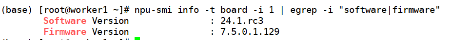
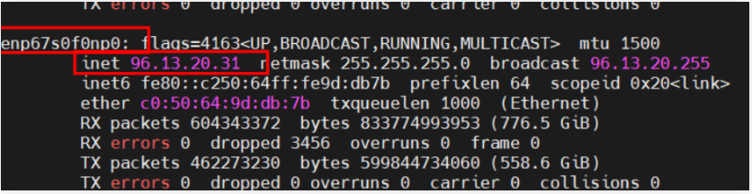
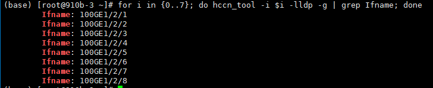
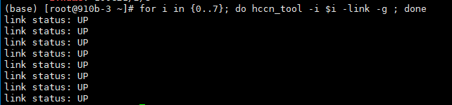
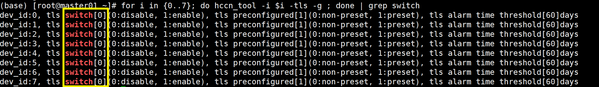
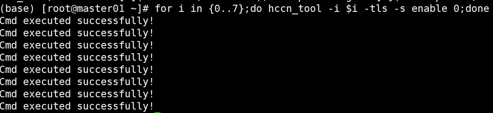
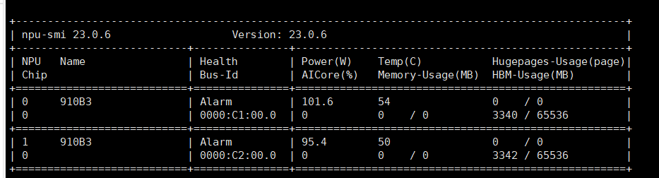
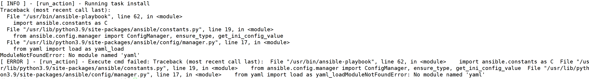
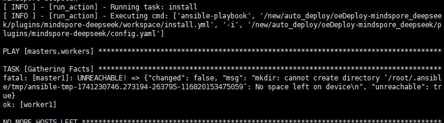

# DeepSeek-V3&R1部署指南

## 1. 硬件要求及组网
本文以DeepSeek-R1为主进行介绍，DeepSeek-V3与R1的模型结构和参数量一致，部署方式与R1相同。

### 1.1 单机部署
部署DeepSeek-R1量化模型（A16W4）需要1台Atlas 800I A2（8\*64G）服务器。

### 1.2 多机部署
部署DeepSeek-R1量化模型（W8A8）至少需要2台Atlas 800I A2（8\*64G）服务器。

组网结构推荐使用npu直连模式，即两台服务器的**所有npu卡通过交换机连接，网络端口UP**


## 2. 模型权重获取

| 序号 | 检查项                   | 详细说明                                                     |
| ---- | ------------------------ | ------------------------------------------------------------ |
| 2.A  | 模型权重存储空间         |  下载A16W4/W8A8权重时，需确保机器内/挂载盘中有大于400G/700G的存储空间。  |
| 2.B  | CPU侧内存                | 需确保CPU侧内存能够放下对应权重。<br>例：W8A8权重需要大约500G左右的内存，可通过free -h指令查看空闲cpu内存。<br>计算方式：free_mem >= (权重大小 / 机器数) * 1.3 （该计算方式待验证，但需要确保内存足够） |
| 2.C  | 根据权重大小选择推理卡数 | W8A8至少需要2台800I/T A2 64G。                               |
| 2.D  | 权重正确性检查           | 请确保权重的正确性，对比权重/tokenizer等文件与源文件的MD5或SHA256值。 |

### 2.1 量化模型权重下载

 A16W4：modelers.cn   [IPADS/DeepSeek-R1-A16W4 \| 魔乐社区](https://modelers.cn/models/IPADS/DeepSeek-R1-A16W4)

 W8A8：modelers.cn   [MindSpore-Lab/DeepSeek-R1-W8A8 \| 魔乐社区](https://modelers.cn/models/MindSpore-Lab/DeepSeek-R1-W8A8)


#### 2.1.1 权重放置【重要】

所有机器均需要放置权重，且放置在相同路径下。该路径后续需作为配置项，填写进一键部署脚本的配置文件中(见4.1章节)。

例如: 主节点模型权重放置在/home/ds/deepseek-r1下，从节点也需放置在/home/ds/deepseek-r1


## 3. 驱动&固件准备

### 3.1 推荐版本

| 部件                | 社区版      |
| ------------------- | ----------- |
| Ascend HDK Driver   | 24.1.rc3    |
| Ascend HDK Firmware | 7.5.0.1.129 |

#### 3.1.1 hdk下载方式

**社区版本下载链接**：https://www.hiascend.com/hardware/firmware-drivers/community?product=4&model=32&cann=8.0.0.alpha002&driver=1.0.RC2

该版本要求内核版本为5.10，安装前校验内核版本

```shell
# 可以使用如下命令获取环境上的驱动&固件版本信息
npu-smi info -t board -i 1 | egrep -i "software|firmware"
```



注意：在安装驱动和固件时，需要提前安装kernel-devel和kernel-headers包，且确保版本和服务器内核的版本保持一致

```shell
# 安装kernel-devel & kernel-headers
yum install -y kernel-devel-$(uname -r) kernel-headers-$(uname -r)
```


#### 3.1.2 驱动&固件安装

环境上没有昇腾驱动&固件，首次安装可采用以下方式：

```shell
# 方式1：
# 驱动安装
./Ascend-hdk-<chip_type>-npu-driver_<version>_linux-<arch>.run --full --install-for-all
# 固件安装
./Ascend-hdk-<chip_type>-npu-firmware_<version>.run --full

# 方式2：需先下载部署插件包，该脚本在插件包内。参考4.2章节
sh mindspore-deepseek/workspace/roles/prepare/files/lib/ascend_prepare.sh
# 安装后需要重启
```

环境已有昇腾驱动&固件可跳过该步骤


## 4. 一键式部署脚本介绍

| 序号 | 检查项       | 详细说明                                                     |
| ---- | ------------ | ------------------------------------------------------------ |
| 4.A  | 权重检查     | 4.1 step2章节，运行一键部署前，请确保完成第2章节，权重获取   |
| 4.B  | 驱动固件检查 | 4.1 step2章节，运行一键部署前，请确保已经在所有宿主机上安装Ascend HDK driver & firemare。如未安装，参考3.1.2章节 |
| 4.C  | 组网联通检查 | 4.1 step2章节，运行一键部署前，请确保组网联通性，建议参考5.3章节检测网络 |

使用一键式部署脚本，可根据配置，一键部署单节点/双节点集群，并且拉起deepseek服务。

### 4.1 部署脚本使用

一键式部署脚本推荐在**单独控制节点**执行，控制节点需要可以使用ssh访问各个推理节点，**注意：单机部署需要根据注释调整Step2中配置文件**

**Step1：下载oedeploy工具（下载到控制节点）**

```shell
# 下载安装oedp工具，例如:
wget https://repo.oepkgs.net/openEuler/rpm/openEuler-24.03-LTS/contrib/oedp/aarch64/Packages/oedp-1.0.0-2.oe2503.aarch64.rpm

yum localinstall oedp-1.0.0-2.oe2503.aarch64.rpm
# 下载插件包
git clone https://gitee.com/openeuler/llm_solution.git

cd llm_solution/script/mindspore-deepseek
```

**Step2：调整oedeploy配置文件**

```shell
# 调整mindspore-deepseek目录下config.yaml
(base) [root@910b-3 mindspore-deepseek]# cat config.yaml 
all:
  children:
    masters:
      hosts:
        master1:
          ansible_host: 1.2.3.4  # 主节点ip
          ansible_port: 22
          ansible_user: root  # 必须用root启动或者有权限
          ansible_password: "密码" # 主节点密码

    workers:  #单机部署，无需workers节点，请注释或删去workers内容
      hosts:
        worker1:
          ansible_host: 1.2.3.5 # 从节点ip
          ansible_port: 22
          ansible_user: root
          ansible_password: "密码"  # 从节点密码

  vars:
    # 容器镜像
    # 如果本地docker上已加载镜像，改成docker image的image_name和image_tag
    image_name: hub.oepkgs.net/oedeploy/openeuler/aarch64/mindspore
    image_tag: 20250415  # 单机部署时，建议使用tag为20250326的容器镜像
    # 将要拉起的推理容器的名称
    container_name: openeuler_ds  # 启动之后的docker name，不能和已有镜像重名
    # 模型路径
    model_path: /workspace/deepseekv3  #根据实际模型文件及权重路径修改（2.2.1章节放权重的路径）
    # ray 开放的端口
    ray_port: 6379 # 脚本从这里读端口
    # 节点个数，如单机部署，请修改为1
    node_num: 2 
    # 拉起服务前是否停止其他容器
    is_stop_other_container: 0  # 0：不停止其他容器；1：停止其他容器
    # 推理服务端口
    llm_port: 8000 # 需确保该端口空闲
    # ray集群使用的网卡
    ray_device: enp67s0f0np0  # ifconfig查找ip对应网卡的网卡名
    # 模型权重类型
    model_type: safetensors
    # 跳过 ssh 校验（如需禁用此功能，请注释以下配置项）
    ansible_ssh_common_args: '-o StrictHostKeyChecking=no'
```

启动master为主节点，worker为从节点，进行部署前，需要调整对应节点的ip地址，用户名，以及密码。

当控制节点可以和两台环境可以通过密钥免密通信时，ansible_password变量可以设置为空。

请确保node_num的值与配置的ip个数一致。

请确保各个节点上使用的网卡设备一致，配置到ray_device变量中

配置文件中的ray_device为ray集群所使用的网卡设备名称，可使用ifconfig查看，例如：



**Step3：运行一键部署脚本**

```shell
# mindspore-deepseek目录下运行 
oedp run install
```

注意：一键部署流程中，会联网拉去容器镜像，安装docker命令，若无法连接网络。可提前自行安装docker，并将对应docker镜像load进服务器。在部署脚本运行中，如果检测到已有相同镜像存在，则会跳过从网络拉去镜像的环节。


## 5. 半自动化按需部署

除了使用一键式部署脚本，也可以手动执行分步脚本。

需要将mindspore-deepseek目录下workspace/roles/prepare/files/lib目录传输至所有推理节点。

传输脚本前，请务必调整config.cfg配置文件。

### 5.1 修改配置文件

```shell
# 复制模板config，该example在lib文件夹内
cp example_config config.cfg
# 调整config.cfg
```

注意，复制生成的文件名字必须为config.cfg

### 5.2 加载推理镜像

```shell
# 需在所有节点执行容器拉取脚本，改脚本包含容器镜像拉取，容器启动两个步骤
./lib/start_docker.sh
```

在拉取容器前会检测环境，若环境上有同名镜像，则不会进行拉取

在启动容器前会检测环境，若环境上有同名容器(无论是运行态还是停止态)，均会使用已存在的容器

### 5.3 网络检查（单机部署可忽略本步骤）

可在各个节点调用网络检测脚本

```shell
./lib/net_check.sh
```

该脚本内，会检测各个节点的npu卡link状态，以及网络健康状态。

也可按照如下步骤手动检查

#### 5.3.1 检查机器网络情况【宿主机】

**step1:** 检查物理链接

```shell
for i in {0..7}; do hccn_tool -i $i -lldp -g | grep Ifname; done 
```



**step2:** 检查链接情况

```shell
for i in {0..7}; do hccn_tool -i $i -link -g ; done
```



**Step3:** 获取每张卡的ip地址

```shell
for i in {0..7};do hccn_tool -i $i -ip -g; done
```


若npu卡无ip，可使用如下命令配置ip地址与netmask。注意主从节点的npu配置的ip不可一致

```shell
# 主节点
for i in {0..7}
do
hccn_tool -i $i -ip -s address 10.10.0.1$i netmask 255.255.0.0
done
# 从节点
for i in {0..7}
do
hccn_tool -i $i -ip -s address 10.10.0.2$i netmask 255.255.0.0
done
```

也可以使用插件包中的辅助脚本npu_net_config_simple.sh进行ip配置

```shell
cd lib
sh npu_set_config_simple.sh 1       # 主节点
sh npu_set_config_simple.sh 2       # 从节点
```

如果只有一台机器A存在IP，另外一台没有，可以参考已有的IP网段和netmask配置命令，注意IP不要配置


**Step4**：检测NPU底层TLS行为一致性，每台机器需要是一样的值，建议全0

```shell
for i in {0..7}; do hccn_tool -i $i -tls -g ; done | grep switch
```



**Step5：**NPU底层tls校验行为置0操作

```shell
for i in {0..7};do hccn_tool -i $i -tls -s enable 0;done
```



使用npu-smi info命令检测网卡状态是否均为ok，若存在如下图状态异常的卡，可尝试重置npu



重置npu使用可以使用如下命令

```shell
npu-smi set -t reset -i $id -c $chip_id
```

#### 5.3.2 检测机器间互联情况【宿主机】

机器间互联检测可以通过本机每张npu卡ping其他主机的npu卡ip地址，能ping通表示正常。

可使用脚本检测机器互联情况

```shell
./net_check.sh --check-connection
```

### 5.4 环境配置

该步骤在容器内执行，需在所有节点执行

**Step1:** 可使用环境配置脚本，一键设置环境变量，以及调整配置文件：

```shell
# 需在所有节点执行该脚本，改脚本包含调整配置文件，设置环境变量两个步骤
./lib/set_env.sh
```

该脚本运行时，会将环境变量写入/root/.bashrc，若该文件中已有openeuler_deepseek_env_config字段，则视为环境变量已存在，会跳过环境变量设置流程。

### 5.5 ray集群启动（单机部署可忽略本步骤）

该步骤在容器内执行，需在所有节点执行

**Step1:** 可使用ray启动脚本，一键启动ray，调整MASTER_IP为主节点ip：

```shell
# 主节点先执行
./lib/ray_start.sh
# 从节点后执行 
./lib/ray_start.sh $MASTER_IP
```

使用该脚本前，请确保主节点上，配置文件config.cfg中RAY_PORT项对应端口空闲

### 5.6 服务启动

该步骤在容器内执行，仅在主节点执行

**Step1:** 可在主节点中启动服务，使用前请务必配置好config.cfg：

```shell
#主节点执行 该脚本启动服务的日志，会存于ds.log中
./lib/start_ds.sh
```

### 5.7 细粒度绑核

该步骤在宿主机执行，需在所有节点执行

**Step1:** 可用绑核脚本，进行细粒度绑核提升性能

```shell
# 所有节点执行
python ./lib/fine-grained-bind-cann.py
```


## 6. 服务化测试

### 6.1 使用Benchmark测试【容器内】

使用ascend-vllm性能测试工具

```shell
python benchmark_parallel.py --backend openai --host [主节点IP] --port [服务端口] --tokenizer [模型路径] --epochs 1 --parallel-num 192 --prompt-tokens 256 --output-tokens 256
```

注意: --tokenizer指定的模型路径，要和启动推理服务时的model_path一模一样

也可使用vllm开源的性能测试工具

<https://github.com/vllm-project/vllm/tree/main/benchmarks>

### 6.2 使用curl请求测试

 Deepseek-R1请求样例（**请按照配置的LLM_PORT变量调整请求端口**）

```shell
curl http://localhost:$LLM_PORT/v1/completions -H "Content-Type: application/json" -d '{"model": "'$MODEL_PATH'", "prompt": "You are a helpful assistant.<｜User｜>将文本分类为中性、负面或正面。 \n文本：我认为这次假期还可以。 \n情感：<｜Assistant｜><think>\n", "max_tokens": 512, "temperature": 0, "top_p": 1.0, "top_k": 1, "repetition_penalty":1.0}'
```

 结果:

## 7. FAQ

### 7.1 安装ascend驱动时显示Decompression fail

缺少tar命令，需安装tar包

### 7.2 运行oedp run install报错找不到库

> 

Oedp兼容性bug，原因为环境上安装了多个py，互相干扰，建议在只有一个python的环境上安装oedp

或者调整/usr/bin/oedp文件，将python3调整为具体的python版本

### 7.3 运行部署时显示空间不足

> 

请确保各个节点根目录有足够空间

### 7.4 模型推理时显示CUDA Paged Attrntion kernel only supports block sizes up to 32.
MindSpore向后兼容性约束，早期限制block size为32大小，25年3月30号后已去除该限制。建议使用tag时间点在250330后的容器镜像。


## 附录

### 环境变量说明：

| **环境变量**                                        | **功能说明**                    |
| --------------------------------------------------- | ------------------------------- |
| MS_ENABLE_LCCL=off                                  | 关闭多机lccl                    |
| HCCL_OP_EXPANSION_MODE=AIV                          | 通信下发优化                    |
| vLLM_MODEL_BACKEND=MindFormers                      | 指定使用mindformers后端         |
| vLLM_MODEL_MEMORY_USE_GB=50                         | 性能优化相关                    |
| MS_DEV_RUNTIME_CONF="parallel_dispatch_kernel:True" | 性能相关                        |
| MS_ALLOC_CONF="enable_vmm:False"                    | 电信特有                        |
| ASCEND_RT_VISIBLE_DEVICES=0,1,2,3,4,5,6,7           | 指定可使用的ascend卡            |
| GLOO_SOCKET_IFNAME=网卡名称                         | ray组网需要                     |
| TP_SOCKET_IFNAME=网卡名称                           | ray组网需要                     |
| MINDFORMERS_MODEL_CONFIG=yaml路径                   | 指定mindformers要使用的模型yaml |
| HCCL_CONNECT_TIMEOUT=7200                           | 设置hccl超时时间                |

### Mindspore-deepseek插件包目录结构

```shell
[root@localhost mindspore-deepseek]# tree -l
.
├── config.yaml
├── main.yaml
├── README.md
└── workspace
    ├── install.yml
    └── roles
        ├── prepare
        │   ├── files
        │   │   ├── lib
        │   │   │   ├── ascend_prepare.sh
        │   │   │   ├── example_config
        │   │   │   ├── fine-grained-bind-cann.py
        │   │   │   ├── net_check.sh
        │   │   │   ├── npu_net_config_simple.sh
        │   │   │   ├── ray_start.sh
        │   │   │   ├── set_env.sh
        │   │   │   ├── start_docker.sh
        │   │   │   └── start_ds.sh
        │   │   └── prepare.sh
        │   ├── tasks
        │   │   └── main.yml
        │   └── templates
        │       └── config.cfg.j2
        └── start
            ├── deepseek
            │   └── tasks
            │       └── main.yml
            ├── ray-master
            │   └── tasks
            │       └── main.yml
            └── ray-worker
                └── tasks
                    └── main.yml
14 directories, 19 files
```

