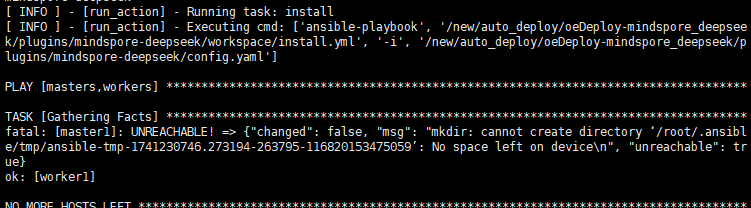

# qwen系列-300IDuo-部署指南

## 1. 模型支持情况

| 模型 |    已支持规格      |
| ---- | ------------------------ | 
| Qwen2.5  |  3B, 7B, 14B, 32B   |
| Qwen3  |  4B, 8B, 14B, 32B   |
| Qwen3-moe  |  支持中   |
| Qwen2.5-VL  |  支持中   |

## 2. 模型权重获取

| 序号 | 检查项                   | 详细说明                                                     |
| ---- | ------------------------ | ------------------------------------------------------------ |
| 2.A  | 模型权重存储空间         |  下载权重时，需确保机器内/挂载盘中有足够的存储空间。 <br>例： qwen2.5-14B需要至少30G的内存|
| 2.B  | CPU侧内存                | 需确保CPU侧内存能够放下对应权重。<br>例：可通过free -h指令查看空闲cpu内存。<br>计算方式：free_mem >= (权重大小 / 机器数) * 1.3 （该计算方式待验证，但需要确保内存足够） |
| 2.C  | 根据权重大小选择推理卡数 |  目前可支持tp4，tp2，单卡进行推理                   |
| 2.D  | 权重正确性检查           | 请确保权重的正确性，对比权重/tokenizer等文件与源文件的MD5或SHA256值。 |

### 2.1 模型权重下载

可从huggingface获取对应权重，以下以qwen2.5-14B为例进行说明，权重下载链接为：[Qwen2.5-14B](https://huggingface.co/Qwen/Qwen2.5-14B) 。

下面以下载到`/home/ckpt/qwen2.5-14B` 目录为例。

#### 注意事项：
* 由于300IDuo不支持bfloat16的数据格式，将 `/home/ckpt/qwen2.5-14B/config.json` 中torch dtype设置成float16： `"torch_dtype": "float16",`


## 3. 驱动&固件准备

### 3.1 推荐版本

| 部件                | 社区版      |
| ------------------- | ----------- |
| Ascend HDK Driver   | 24.1.rc3    |
| Ascend HDK Firmware | 7.5.0.1.129 |

#### 3.1.1 hdk下载方式

**社区版本下载链接**：https://www.hiascend.com/hardware/firmware-drivers/community?product=4&model=32&cann=8.0.0.alpha002&driver=1.0.RC2

该版本要求内核版本为5.10，安装前校验内核版本

```shell
# 可以使用如下命令获取环境上的驱动&固件版本信息
npu-smi info -t board -i 1 | egrep -i "software|firmware"
```


注意：在安装驱动和固件时，需要提前安装kernel-devel和kernel-headers包，且确保版本和服务器内核的版本保持一致

```shell
# 安装kernel-devel & kernel-headers
yum install -y kernel-devel-$(uname -r) kernel-headers-$(uname -r)
```

#### 3.1.2 驱动&固件安装

环境上没有昇腾驱动&固件，首次安装可采用以下方式：

```shell
# 方式1：
# 驱动安装
./Ascend-hdk-<chip_type>-npu-driver_<version>_linux-<arch>.run --full --install-for-all
# 固件安装
./Ascend-hdk-<chip_type>-npu-firmware_<version>.run --full

# 方式2：需先下载部署插件包，该脚本在插件包内。参考4.1章节
sh mindspore-deepseek/workspace/roles/prepare/files/lib/ascend_prepare.sh
# 安装后需要重启
```

环境已有昇腾驱动&固件可跳过该步骤


## 4. 部署步骤


### 拉取镜像

```shell
# aarch64
docker pull hub.oepkgs.net/oedeploy/openeuler/aarch64/intelligence_boom:0.1.0-aarch64-300I-Duo-mindspore2.7-openeuler24.03-lts-sp2

# x86_64
docker pull hub.oepkgs.net/oedeploy/openeuler/x86_64/intelligence_boom:0.1.0-x86_64-300I-Duo-mindspore2.7-openeuler24.03-lts-sp2
```

### 启动镜像
 
假设您的NPU设备安装在/dev/davinci[0-3]上，并且您的NPU驱动程序安装在/usr/local/Ascend上：

```shell
docker run -it -u root --name=qwen --net=host --ipc=host --privileged=true \
    --device=/dev/davinci0 \
    --device=/dev/davinci1 \
    --device=/dev/davinci2 \
    --device=/dev/davinci3 \
    --device=/dev/davinci_manager \
    --device=/dev/devmm_svm \
    --device=/dev/hisi_hdc \
    -v /usr/local/Ascend/driver:/usr/local/Ascend/driver \
    -v /usr/local/Ascend/add-ons/:/usr/local/Ascend/add-ons/ \
    -v /usr/local/sbin/:/usr/local/sbin/ \
    -v /var/log/npu/slog/:/var/log/npu/slog \
    -v /var/log/npu/profiling/:/var/log/npu/profiling \
    -v /var/log/npu/dump/:/var/log/npu/dump \
    -v /var/log/npu/:/usr/slog \
    -v /etc/hccn.conf:/etc/hccn.conf \
    hub.oepkgs.net/oedeploy/openeuler/aarch64/intelligence_boom:0.1.0-aarch64-300I-Duo-mindspore2.7-openeuler24.03-lts-sp2 \
    /bin/bash
```
### 服务化部署
镜像内已预置了部署脚本:

```shell
export MS_ENABLE_LCCL=off   #关闭多机lccl 
export HCCL_OP_EXPANSION_MODE="AI_CPU"  #通信下发优化 
export ASCEND_RT_VISIBLE_DEVICES=0,1,2,3  #指定可使用的ascend卡

vllm-mindspore serve "/home/ckpt/qwen2.5-14B/" --trust_remote_code --tensor_parallel_size=4 --max-num-seqs=256 --block-size=128 --gpu-memory-utilization=0.5 --max-num-batched-tokens=4096 --max-model-len=8192 2>&1 | tee log.txt
```
启动参数的含义见**附录**，如果需要运行不同的模型，需要修改**权重路径**和**gpu-memory-utilization**(见FAQ 6.3)。


## 5. 服务化测试

### 5.1 使用Benchmark测试【容器内】

使用ascend-vllm性能测试工具

```shell
python benchmark_parallel.py --backend openai --host [主节点IP] --port [服务端口] --tokenizer [模型路径] --epochs 1 --parallel-num 192 --prompt-tokens 256 --output-tokens 256
```

注意: --tokenizer指定的模型路径，要和启动推理服务时的model_path一模一样

也可使用vllm开源的性能测试工具

<https://github.com/vllm-project/vllm/tree/main/benchmarks>

### 5.2 使用curl请求测试

 qwen2.5-14B请求样例（**请按照配置的LLM_PORT变量调整请求端口**）

```cpp
curl http://localhost:8000/v1/completions \
  -H "Content-Type: application/json" \
  -d '{
    "model": "/home/ckpt/qwen2.5-14B",
    "prompt": "Mindspore is",
    "max_tokens": 120,
    "temperature": 0
  }'
```

#### 注意：

**目前还不支持设置seed，可能会导致服务崩溃**

## 6. FAQ

### 6.1 安装ascend驱动时显示Decompression fail

缺少tar命令，需安装tar包


### 6.2 运行部署时显示空间不足

> 

请确保各个节点根目录有足够空间

### 6.3 报错format_cast空间不足

在部署的模型权重较小时，如果gpu-memory-utilization设置的过大，会导致分配过大的kv cache，使得在300IDuo格式转换算子报错，以下列出推荐的gpu-memory-utilization设置：
| **权重大小**    | **gpu-memory-utilization**                    |
| ------------- | ---------|
| 32B         | 0.8                    |
| 14B         | 0.5                    |
| 8B/7B/4B/3B      | 0.3         |


## 附录

### vllm-mindspore部分启动参数说明：

| **启动参数**                                        | **功能说明**                    |
| --------------------------------------------------- | ------------------------------- |
| /home/ckpt/qwen2.5-14B/                             | 权重地址                    |
| trust_remote_code                         | 允许执行模型的自定义代码                    |
| tensor_parallel_size                      | tp并行数量设置        |
| max-num-seqs                         | 最大同时处理的输入batch数量                    |
| block-size | kvcache每个block的大小                        |
| gpu-memory-utilization                    | 模型占用的gpu内存大小                        |
| max-num-batched-tokens           | 最大能同时处理的token数量            |
| max-model-len                        | 单个输入最大的token数量                     |


